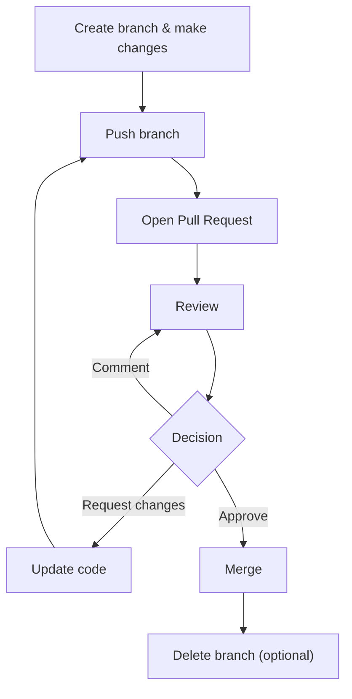

# ✅ GH‑900 Labs – Day 1

| Module | Exercise Name | Link |
| --- | --- | --- |
| Introduction to GitHub | A guided tour of GitHub | [Introduction to GitHub](https://github.com/skills/introduction-to-github) |
| Communicate effectively on GitHub using Markdown | Communicate using Markdown | [Communicate using Markdown](https://github.com/skills/communicate-using-markdown) |
| Contribute to an open-source project on GitHub | Create your first pull request | [Create your first PR](https://learn.microsoft.com/en-us/training/modules/contribute-open-source/4-exercise-create-pr/?ns-enrollment-type=learningpath&ns-enrollment-id=learn.github-foundations) |
| Manage repository changes by using pull requests on GitHub | Reviewing pull requests | [Review Pull Requests](https://github.com/skills/review-pull-requests) |

---

Perfect — here are the **remaining GH‑900 labs for tomorrow (Day 2)** based on your original markdown list, with **Introduction to Git excluded** ✅

***

### ✅ **GH‑900 Labs – Day 2 **

| Module  | Exercise Name  | Link  |
| --- | --- | --- |
| Introduction to GitHub Copilot                              | Develop with AI-powered code suggestions by using GitHub Copilot and VS Code | https://github.com/skills/getting-started-with-github-copilot  |
| Code with GitHub Codespaces                                 | Code with Codespaces and Visual Studio Code                                  | https://github.com/skills/code-with-codespaces |
| Manage an InnerSource program by using GitHub               | InnerSource fundamentals                                                     | <https://learn.microsoft.com/en-us/training/modules/manage-innersource-program-github/3-innersource-fundamentals/?ns-enrollment-type=learningpath&ns-enrollment-id=learn.github-foundations>     |
| Maintain a secure repository by using GitHub best practices | Secure your repository's supply chain                                        | https://github.com/skills/secure-repository-supply-chain |
| Search and organize repository history by using GitHub      | Connect the dots in a GitHub repository                                      | https://github.com/skills/connect-the-dots        |
| Using GitHub Copilot with Python                            | Update a Python web API with GitHub Copilot                                  | <https://learn.microsoft.com/en-us/training/modules/introduction-copilot-python/5-exercise-python-web-api/?ns-enrollment-type=learningpath&ns-enrollment-id=learn.github-foundations>            |

***

