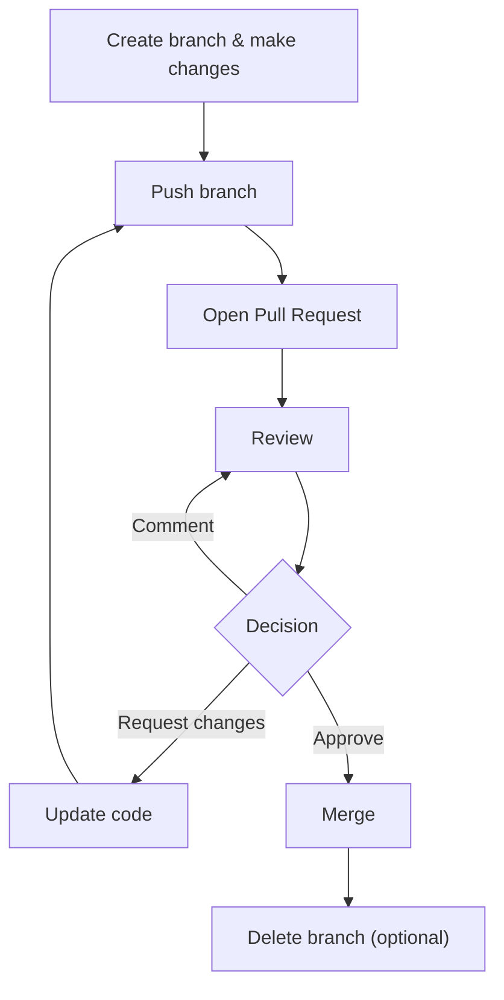

### ✅ **GH‑900 Labs – Day 1**

| Module                                                     | Exercise Name                  | Link                                                                                                                                                                                       |
| ---------------------------------------------------------- | ------------------------------ | ------------------------------------------------------------------------------------------------------------------------------------------------------------------------------------------ |
| Introduction to GitHub                                     | A guided tour of GitHub        | [https://github.com/skills/introduction-to-github](https://github.com/skills/introduction-to-github)             |
| Communicate effectively on GitHub using Markdown           | Communicate using Markdown     | [https://github.com/skills/communicate-using-markdown](https://github.com/skills/communicate-using-markdown)  |
| Contribute to an open-source project on GitHub             | Create your first pull request | https://learn.microsoft.com/en-us/training/modules/contribute-open-source/4-exercise-create-pr/?ns-enrollment-type=learningpath&ns-enrollment-id=learn.github-foundations                |
| Manage repository changes by using pull requests on GitHub | Reviewing pull requests        | [https://github.com/skills/review-pull-requests](https://github.com/skills/review-pull-requests) |

***

